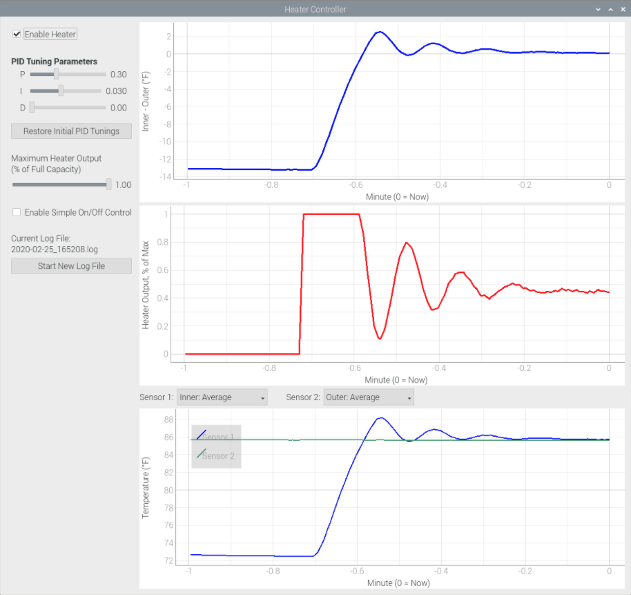

# heater-controller

A PID-based Electric heater controller built with Python 3.7 and the PyQt5 
GUI framework.  The controller's objective is to force a zero temperature difference
between two spaces.  Each space can have multiple temperature sensors for better
accuracy, and the temperature values are averaged for control purposes.

This program is specifically being used to control a heater within a Heat Pump 
efficiency test chamber at the Cold Climate Housing Research Center (CCHRC) in 
Fairbanks, Alaska.  CCHRC funded the development of this software.

Thermistor temperature sensors are read through use of a Labjack U3 data 
acquisition device.  Electric Heater control is through a Pulse-width modulated
Solid State Relay, also driven by the Labjack U3.  A Raspberry Pi 4 is used to
run the program and interface with the Labjack.

Here is a screenshot of the program in operation.  Graphs update in realtime.



Use of the program requires that a `settings.py` file be present in the `user/`
directory.  A sample `settings.py` file is provided in the root directory of
this repo and named `settings_example.py`.  This example file should be copied
into the `user/` directory, renamed to `settings.py`, and modified according
to instructions and comments found in the file.

The GUI program is run by executing the `main_window.py` file, a Python 3 script
found in the root directory of the repo.
A simple command line control program with no graphing, no logging and only text
output is provided in the `main.py` script.

**NOTE:**  *After booting the Raspberry Pi, wait at least 30 seconds before starting 
the heater control program so that the clock on the Pi has time to sync with the
Internet.*

The `main_window.py` script logs temperature and heater output data to log files
located in the `logs/` directory.  A new log file is created upon every fresh start
of the `main_window.py` script.  Also, a new log file can be created by clicking
the button in the left column of the GUI interface.

Each line in the log file is the string representation of a Python dictionary.
There are dictionaries nested within the dictionary to indicate the structure of
the data.  To help understand the format (and as an example of how to read the
log file format), execute this Python script, replacing the file name with an 
actual log file name:

```python
from pprint import pprint
from math import nan

for lin in open('2020-02-26_081245.log'):
    data = eval(lin)
    pprint(data)
    break
```

which for a setup with only one inner chamber thermistor and one outer chamber
thermistor produces output like:

```python
{'delta_t': -8.84,
 'info': {'average': nan, 'detail': {}},
 'inner': {'average': 78.37, 'detail': {'Upper Left Inlet': 78.37}},
 'outer': {'average': 87.21, 'detail': {'Top': 87.21}},
 'pwm': 1.0,
 'timestamp': 1582737168.422}
```

## Developer Information

As stated before, the main scripts to run the controller are:

`main_window.py`:  Launches the GUI interface to the controller.

`main.py`:  Runs a simple command line controller and is mostly useful
for testing and understanding the bare necessities for a control application.

Important files related to implementing the controller are (all in the 
`heatercontrol` subdirectory):

`controller.py`:  Implements the main control logic in the `run()` method
of the `Controller` class.  The control process runs in its own thread.

`U3protected.py`:  Contains a class `U3protected` that controls access to a
Labjack U3 device so that the U3 can safely be accessed from multiple threads.

`analog_reader.py`:  Contains classes that allow for continual reading of
analog channels on the Labjack U3.  It provides a ring buffer for each channel
read so that a current average for the channel can be returned.  The ring buffer
averages out noise on the channel.

`pwm.py`:  Contains a class to implement PWM output on a digital output
channel of the Labjack U3.

`thermistor.py`:  Contains a class that facilitates reading temperatures from
thermistors.
